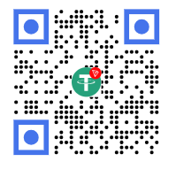

# 🤖 Discord Bot Website Template v3

A **modern, responsive, and beautifully designed** website template for Discord bots. Built with **pure HTML, Tailwind CSS, and vanilla JavaScript** — no frameworks, no dependencies, just clean code.

Perfect for Discord bot creators who want a professional, fast-loading website to showcase their bot.

---

## ✨ What's New in v3?

### 🚀 Major Improvements:

- **Replaced Bootstrap with Tailwind CSS** - Smaller footprint, faster performance
- **Pure HTML & Vanilla JS** - No jQuery, no dependencies
- **Modern Discord-Inspired Design** - Dark theme with gradient accents and smooth animations
- **Command Search Functionality** - Real-time search across all bot commands
- **Dynamic Copyright Year** - Automatically updates each year
- **Fully Responsive** - Mobile-first design, works perfectly on all devices
- **Clean Code Architecture** - Well-organized, easy to customize
- **GitHub Integration** - Direct links to your GitHub profile

### 🔄 Version History:

| Version | Framework                     | Status                     |
| ------- | ----------------------------- | -------------------------- |
| v1      | Bootstrap                     | Archived                   |
| v2      | Bootstrap + jQuery            | Available in `v2.0` branch |
| **v3**  | **Tailwind CSS + Vanilla JS** | **Current** ✨             |

---

## 📄 Pages Included

### **🏠 Home Page** (`src/index.html`)

- Hero section with call-to-action buttons
- Features showcase with hover effects
- Statistics dashboard
- How it works section with step-by-step guide
- Invitation prompt with strong CTAs
- Responsive footer with social links

### **⚙️ Commands Page** (`src/pages/commands.html`)

- **Search bar** - Find commands instantly
- Organized by categories:
  - ⚔️ Moderation Commands
  - 🛠️ Utility Commands
  - 🎮 Fun Commands
  - 👨‍💼 Admin Commands
- Command descriptions and usage examples
- Permission requirements displayed
- Mobile-responsive grid layout

---

## 🎨 Design Features

✅ **Dark Theme** - Discord-inspired color palette  
✅ **Gradient Effects** - Modern gradient text and backgrounds  
✅ **Smooth Animations** - Hover effects and transitions  
✅ **Accessibility** - Semantic HTML, keyboard navigation  
✅ **Performance** - Optimized for speed and SEO  
✅ **Mobile First** - Perfect on all screen sizes

---

## 🛠️ Built With

- **[Tailwind CSS](https://tailwindcss.com/)** - Utility-first CSS framework (CDN)
- **HTML5** - Semantic markup
- **Vanilla JavaScript** - No frameworks, pure JS
- **[Google Fonts](https://fonts.google.com/)** - Inter font family

**Zero external dependencies!** Just pure, clean code.

---

## 📦 Project Structure

```
src/
├── index.html                 # Home page
├── css/
│   └── main.css              # All custom styles
└── pages/
    └── commands.html         # Commands page
```

---

## 🚀 Quick Start

### 1. **Clone the Repository**

```bash
git clone https://github.com/Hadi-4100/Discord-bot-website-template.git
cd Discord-bot-website-template
```

### 2. **Customize Your Bot**

Edit these files to match your bot:

**`src/index.html`:**

- Change bot name from "Aris Bot" to your bot name
- Update descriptions and features
- Modify invitation links
- Add your Discord server/support links

**`src/css/main.css`:**

- Adjust colors (currently using purple/blue gradient)
- Customize fonts and spacing

**`src/pages/commands.html`:**

- Add your bot commands
- Update command descriptions
- Add permissions information

### 3. **Deploy**

Just upload the `src/` folder to any web hosting:

- GitHub Pages
- Netlify
- Vercel
- Traditional hosting (cPanel, FTP, etc.)

---

## 🔗 Quick Links

- **GitHub**: [github.com/Hadi-4100](https://github.com/Hadi-4100)
- **Tailwind CSS Docs**: [tailwindcss.com](https://tailwindcss.com)
- **HTML Semantic Reference**: [developer.mozilla.org](https://developer.mozilla.org)

---

## 📄 License

This project is licensed under the **MIT License** - see the [LICENSE](LICENSE) file for details.

You're free to use, modify, and distribute this template for your Discord bot!

---

## 👨‍💻 Author

**[Hadi-4100](https://github.com/Hadi-4100)** - Discord Bot Website Template Creator

---

## ❤️ Support Me

If you found this template helpful, consider supporting me:

<p align="center">
  <div style="margin-bottom: 10px;">
    <a href="https://github.com/Hadi-4100">
      
    </a>
  </div>
  <div>
    <a href="https://github.com/hadi-4100/Discord-bot-website-template/blob/Main/src/img/usdt_wallet.png" title="USDT TRC20 Wallet">
      
    </a>
  </div>
</p>

### 🪙 USDT TRC20 Wallet Address

```
TTNRziDVpYoQKoP9SHR7cmYQ984GcYm8ZU
```

---

## 🎉 Show Your Support

If this template helped you create an amazing bot website, please:

- ⭐ Star this repository
- 🔄 Share with other bot developers
- 🐛 Report issues and suggest features
- 👨‍💻 Contribute improvements

---

**Happy bot website building! 🚀**
